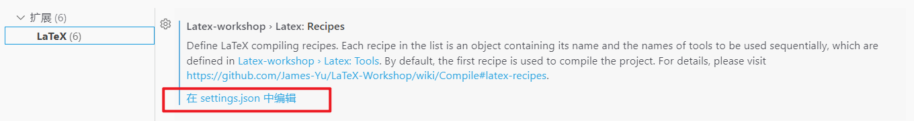

# tju_MasterDr_Latex_template

 Tianjin University thesis latex template for personal use. Based on 2021 revised version.

环境：

* Windows
* VSCode
* Latex Workshop Extension
* texlive 2022

编译工具：xelatex + bibtex

将以下设置补充到Latex-Workshop的recipes设置中

**改完设置完一定记得编译的时候选 `▶ Recipe: xelatex ➞ bibtex`**



```
"latex-workshop.latex.recipes":
[
    {
        "name": "xelatex ➞ bibtex",
        "tools": [
            "xelatexmk",
            "bibtex"
        ]
    }
]
```
